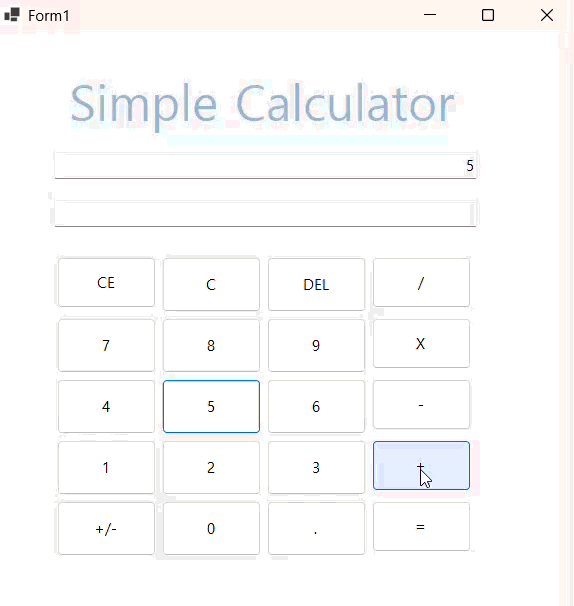
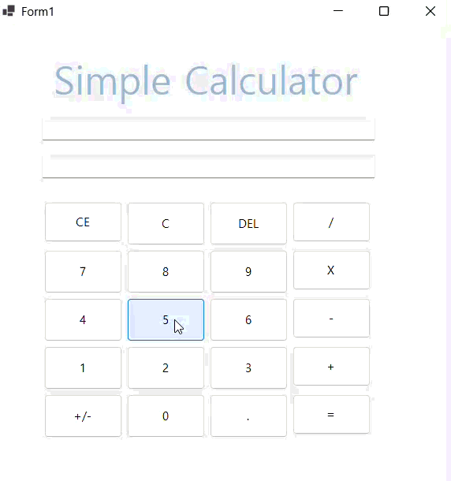
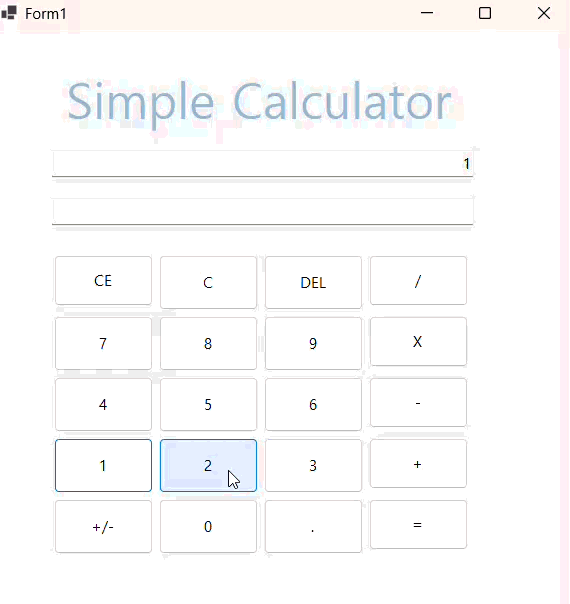

# (C# 코딩) SimpleCalculator
- **이름**: 김재서 (23010114)
- **학과**: 컴퓨터SW학과

---

## 개요
- C# 프로그래밍 학습
- 1줄 소개: 사칙연산과 특수 기능을 수행하는 나만의 계산기 프로그램입니다.
- 사용한 플랫폼: 
	- C#, .NET Windows Forms, Visual Studio, GitHub
- 사용한 컨트롤: 
	- Button (GDI+를 이용한 둥근 모서리 커스텀 렌더링 적용)
	- TextBox (수식과 결과창 분리 및 동적 폰트 크기 조절)
	- TableLayoutPanel (해상도 대응 유연한 레이아웃 구조 설계)
- 사용한 기술과 구현한 기능: 
	- 고급 UI 엔진: Win32 API(CreateRoundRectRgn) 및 GDI+(GraphicsPath)를 이용한 Non-client Area 곡률 제어 및 부드러운 UI 구현
	- 지능형 연산 알고리즘: DataTable.Compute 기반의 수식 파싱 및 스마트 괄호 자동 완성 로직 적용
	- 상태 관리: 다크/라이트 모드 전환 시 실시간 테마 동기화 및 가독성 최적화
	- 예외 처리: 잘못된 수식 입력 및 연산 오류에 대한 안정적인 Try-Catch 예외 처리 및 사용자 피드백 구현

---

## 📸 단계별 실행 화면

## 실행 화면 (과제1)
- 과제1 코드의 실행 스크린샷

- 과제 내용:
	- **TextBox(수식창/결과창)**와 **Button(숫자/연산)**을 적절히 배치하여 계산기 UI를 구성합니다.
	- 숫자 버튼 클릭 시 수식창(txtExpression)에 숫자가 누적되어 표시되도록 합니다.
	- 더하기(+) 버튼 클릭 시 현재 입력된 피연산자를 변수에 저장하고 수식에 연산자를 추가합니다.
	- 결과(=) 버튼 클릭 시 저장된 값과 현재 입력값을 더해 결과창(txtResult)에 최종값을 출력합니다.

- 구현 내용과 기능 설명:
	- UI 설계: TableLayoutPanel을 활용하여 13개의 버튼을 격자 형태로 정렬함으로써 창 크기 조절 시에도 UI가 깨지지 않는 유연한 레이아웃을 완성하였습니다. 상단에는 수식의 흐름을 보여주는 txtExpression과 결과만 표시하는 txtResult를 분리 배치하여 가독성을 높였습니다.
	- 이벤트 통합 처리: 10개의 숫자 버튼(btnNum0~9)을 하나의 공통 이벤트 핸들러(nBtn_Click)로 연결하고, sender 객체를 활용해 클릭된 버튼의 텍스트를 식별함으로써 코드의 중복을 획기적으로 줄였습니다.
	- 수식 누적 로직: 사용자가 숫자를 입력하거나 연산자를 누를 때마다 수식창의 기존 문자열에 데이터를 이어 붙이는 방식을 채택하여, 사용자가 계산 과정을 실시간으로 추적할 수 있도록 구현하였습니다.
	- 데이터 변환 및 연산: double.Parse()를 사용하여 텍스트박스의 문자열 데이터를 수치형 데이터로 변환해 사칙연산을 수행하였으며, 최종 결과는 .ToString() 메서드를 통해 다시 문자열로 변환하여 결과창에 동기화하였습니다.

- 사용한 기술과 구현한 기능:
	- Control 활용: TableLayoutPanel을 이용한 정밀한 UI 배치 기술
	- 이벤트 핸들링: sender 캐스팅을 통한 다중 컨트롤 이벤트 통합 관리
	- 데이터 파싱: string.Split() 및 double.Parse()를 활용한 문자열 내 피연산자 추출 및 수치 변환
	- UX 개선: ReadOnly 속성과 TextAlign 설정을 통한 계산기 특화 입력창 제어

---

## 실행 화면 (과제2)
- 과제2 코드의 실행 스크린샷

- 과제 내용:
	- 더하기(+) 외에 빼기(-), 곱하기(*), 나누기(/) 버튼을 추가하여 사칙연산을 완성합니다.
	- 각 연산자 버튼 클릭 시 동일한 로직(op_Click)이 적용되도록 이벤트를 통합 관리합니다.
	- 계산이 끝난 후에도 이전 결과값을 활용해 연속적인 계산이 가능하도록 로직을 개선합니다.

- 구현 내용과 기능 설명:
	- 사칙연산 통합 처리: switch-case 구문을 도입하여 저장된 operationPerformed 변수 값에 따라 덧셈, 뺄셈, 곱셈, 나눗셈이 유동적으로 수행되도록 구현하였습니다. 0으로 나누기(DivideByZero) 상황에 대한 예외 처리를 추가하여 프로그램의 안정성을 높였습니다.
	- 연속 계산 로직 (UX 개선): = 버튼 클릭 후 새로운 숫자를 입력하면 이전 결과값 뒤에 숫자가 붙어 새로운 피연산자가 되고(예: 100 -> 1006), 연산자를 입력하면 결과값을 시작점으로 즉시 다음 연산이 이어지도록(isCalculationInside 상태 변수 활용) 설계하여 실제 상용 계산기와 유사한 사용성을 확보하였습니다.
	- 수식창 동기화: 수식창(txtExpression)에는 연산 과정이 공백을 포함하여 명확히 표시되도록 하였으며, 결과 출력 시에는 수식창의 가독성을 위해 = 기호를 제외하고 결과값만 깔끔하게 결과창(txtResult)에 출력되도록 제어하였습니다.

- 사용한 기술과 구현한 기능:
	- 제어문 활용: switch-case문을 이용한 다중 연산자 분기 처리 기술
	- 상태 관리: 플래그 변수(bool)를 활용하여 계산 완료 여부에 따른 동적 입력 로직 구현
	- 문자열 조작: string.Split(' ')을 활용하여 복합 수식 문자열에서 특정 피연산자 추출
	- 예외 처리: try-catch 및 조건문을 활용한 잘못된 수식 입력 및 산술 오류 방지

---

## 실행 화면 (과제3)
- 과제3 코드의 실행 스크린샷

- 과제 내용:
	- 수정 및 삭제 기능: C(전체 초기화), CE(마지막 피연산자 삭제), Del(한 글자 삭제) 기능을 구현합니다.
	- 출력 포맷팅: 숫자가 세 자리를 넘을 경우 천 단위마다 콤마(,)를 표시하여 가독성을 높입니다.
	- 연속 계산 로직 고도화: 계산 완료(=) 후 숫자를 누르면 새로 시작하고, 연산자를 누르면 결과값에 이어서 계산되도록 분기 처리합니다.
	- 결과창 제어: 계산 후 새로운 입력이 들어오면 결과창(txtResult)을 자동으로 비워 화면을 정리합니다.

- 구현 내용과 기능 설명:
	- 데이터 정밀 제어 (C/CE/Del):
		- C: 모든 변수와 텍스트박스를 초기화합니다.
		- CE: string.Split(' ')을 활용해 마지막 공백 이후의 숫자 덩어리만 정확히 찾아 제거합니다.
		- Del: string.Remove를 사용해 마지막 문자를 삭제하되, 연산자 앞뒤의 공백이 지워져 데이터가 오염되는 것을 방지하는 방어 로직을 추가하였습니다.
	- 천 단위 콤마(#,##0) 시스템: 숫자를 입력하거나 계산 결과를 출력할 때 실시간으로 콤마를 삽입하는 ApplyCommaToLastOperand 함수를 구현하였습니다. 연산 시에는 Replace(",", "")를 통해 콤마를 제거하고 순수 수치 데이터만 추출하여 계산 오류를 방지하였습니다.
	- 지능형 입력 분기: isCalculationInside 플래그를 사용하여 사용자의 다음 행동을 예측합니다. 결과값 뒤에 바로 숫자를 붙여 큰 수를 만들거나(예: 100 -> 1006), 결과값에 연산자를 붙여 수식을 확장(예: 100 -> 100 +)하는 유연한 흐름을 완성하였습니다.
	- UI 동적 반응: 어떤 버튼이든 클릭되는 순간 txtResult.Clear()를 호출하여 이전 결과가 현재 입력 과정에 혼선을 주지 않도록 UI를 초기화합니다.

- 사용한 기술과 구현한 기능:
	- 문자열 포맷팅: ToString("#,##0")을 이용한 화폐 단위형 숫자 표기 기술
	- 문자열 정제: Replace와 Trim을 활용한 계산용 순수 데이터 추출
	- 논리적 분기: 사용자 시나리오(연속 계산 vs 새 계산)에 따른 조건문 설계
	- 안정성 확보: 연산자 보호 로직 및 TryParse를 통한 비정상적 수식 입력 방지

---

## 실행 화면 (과제4)
- 과제4 코드의 실행 스크린샷

- 과제 내용:
	- 공학용 괄호(()) 기능 추가: 단순 사칙연산을 넘어 괄호가 포함된 복합 수식을 처리할 수 있도록 기능을 확장합니다.
	- 스마트 괄호 버튼 구현: 하나의 버튼으로 수식의 문맥을 판단하여 (와 )를 지능적으로 입력하는 로직을 설계합니다.
	- 프리미엄 UI/UX 적용: 기본 Windows 테마를 탈피하여 다크 모드 기반의 커스텀 디자인과 라운드 버튼을 구현합니다.
	- 수식 히스토리 고도화: = 버튼 클릭 시 상단 수식창에 2 + 5 = 7과 같이 전체 연산 과정이 남도록 개선합니다.

- 구현 내용과 기능 설명:
	- 지능형 괄호 판별 알고리즘 (Context-Aware): 열린 괄호와 닫힌 괄호의 개수를 실시간으로 추적하는 로직을 구현하였습니다. 수식의 마지막 문자가 숫자일 경우 닫는 괄호())를 우선 입력하고, 연산자 뒤이거나 열린 괄호가 없을 때는 여는 괄호(()를 입력하도록 설계했습니다. 특히 숫자 뒤에 바로 여는 괄호를 입력할 경우 문법 오류를 방지하기 위해 자동으로 곱셈 기호(×()를 삽입하는 예외 처리를 추가했습니다.
	- DataTable Engine을 활용한 복합 연산: 문자열 형태의 복합 수식을 사칙연산 우선순위와 괄호 우선순위에 따라 정확히 계산하기 위해 System.Data.DataTable.Compute 메커니즘을 도입하였습니다. 이를 통해 괄호가 중첩된 복잡한 수식도 별도의 파서 구현 없이 안정적으로 처리할 수 있습니다.
	- 커스텀 GDI+ 렌더링 및 UI 설계: System.Drawing.Drawing2D를 활용하여 버튼에 선형 그라데이션(LinearGradientBrush)과 부드러운 라운드 코너(GraphicsPath)를 적용하였습니다. DllImport를 통해 Win32 API를 호출함으로써 폼 전체의 모서리를 둥글게 처리하고, 타이틀 바가 없는 상태에서도 마우스 드래그로 창을 이동할 수 있는 커스텀 헤더 로직을 완성하였습니다.
	- 결과값 히스토리 보존: 교수님의 요구사항에 맞춰 = 클릭 시 txtExpression에 전체 수식과 결과값이 연달아 표시되도록 구성하여 사용자가 계산 이력을 한눈에 확인할 수 있게 하였습니다.

- 사용한 기술과 구현한 기능:
	- 고급 연산 엔진: DataTable.Compute를 활용한 동적 수식 파싱 및 계산 기술
	- 커스텀 그래픽스: GDI+를 이용한 버튼 라운딩 및 그라데이션 커스텀 페인팅
	- Win32 API 연동: CreateRoundRectRgn 및 SendMessage를 활용한 비정형 폼 제어
	- 문법 자동 보정: 괄호 쌍 체크 및 숫자-괄호 사이 자동 연산자 삽입 로직
	- 키보드 인터랙션: 숫자패드 및 특수키(Enter, Esc, Backspace) 전역 매핑 및 동기화